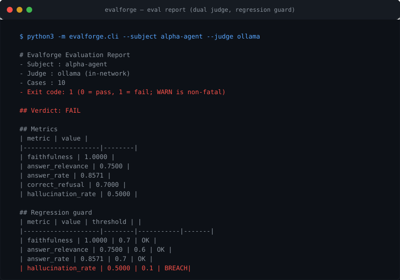

# evalforge

[](LICENSE) [](https://github.com/eLSeR17/evalforge/actions/workflows/ci.yml)

> A standalone, reusable LLM evaluation toolkit: golden datasets + a dual judge
> (deterministic heuristic for CI + LLM-as-judge via local Ollama) + a
> regression guard with semantic exit codes. The demo evaluates the sibling
> portfolio projects (`alpha-agent`, `smart-contract-rag`) as black-box
> subjects — no code copied, no internals imported.

## Demo

An evaluation run of `alpha-agent` with the LLM judge (local Ollama, in-network)
and the regression guard — the verdict is an honest FAIL: the guard fired on
`hallucination_rate` (breach), which is exactly its job.



The numbers above are a real run (see `docs/LIVE_EVAL.md` for the full record,
including the per-case table). Reproduce it with:

```bash
python3 -m evalforge.cli --subject alpha-agent --judge ollama
```

## Problem

Every serious LLM pipeline ships some kind of eval — but the eval harness is
usually *bolted into* the project: domain-specific schemas, hard-wired metrics,
a single judge, no exit-code contract for CI. When you build a second or third
agent, you discover the harness is not reusable. And when you want to compare
two systems side by side, there is no common measuring stick.

## Solution

evalforge is the measuring stick, extracted and generalized from the eval
pipelines of the two sibling portfolio projects. It gives you:

- **Golden datasets** — a versioned, validated JSON contract
  (`id`, `topic`, `question`, `expected_keywords`, `refuse`, `doc_ids`) with
  fail-fast schema validation reporting the exact JSON path of every issue.
- **A dual judge** —
  `HeuristicJudge` (deterministic token-overlap, zero network, CI-safe) and
  `OllamaJudge` (structured 0-5 LLM-as-judge via `http://ollama:11434`, with a
  defensive JSON-parse cascade and graceful fallback to the heuristic).
- **A regression guard** — eight generalized metrics, PASS/WARN/FAIL verdict
  with warn bands, and a semantic exit code (`0` pass, `1` fail; WARN is
  non-fatal by design) so CI can gate on quality regressions.
- **Black-box subjects** — anything exposing `ask(question) -> answer` can be
  evaluated. The registry shows how to adapt a CLI in a Docker container with a
  shell-safe base64 quoting pattern.

The demo that closes the circle evaluates the other two portfolio projects as
subjects: **`alpha-agent`** (an investment-research agent with tools) and
**`smart-contract-rag`** (a RAG over smart-contract audits).

## Demo: evaluating the sibling projects

```bash
# 1. Heuristic judge (no Ollama needed, CI-safe)
python3 scripts/run_e2e.py --subject all --judge heuristic

# 2. Semantic LLM-as-judge — must run inside docker_default (or use rejudge,
#    see "Semantic judging" below); from the host this falls back to the gate
python3 scripts/run_e2e.py --subject smart-contract-rag --judge ollama

# 3. Run the CLI directly against one subject
python3 -m evalforge.cli --subject alpha-agent
```

### What a run produces

`scripts/run_e2e.py` evaluates each subject against its golden dataset and
writes the artifacts to `data/e2e/` (markdown + JSON; the CLI writes the same
artifacts to `data/reports/`). The markdown report is a single self-contained
document: a header (subject, judge, date, case count, exit code), the verdict,
the eight-metric table, a per-case detail table, and the regression-guard
section showing which thresholds were applied and which metrics breached:

```text
# Evalforge Evaluation Report

- **Subject**: `smart-contract-rag`
- **Judge**: `heuristic`
- **Cases**: 12
- **Exit code**: 0 (0 = pass, 1 = fail; WARN is non-fatal)

## Verdict: **FAIL**

## Metrics

| Metric | Value |
|--------|-------|
| faithfulness         | <value> |
| answer_relevance     | <value> |
| citation_accuracy    | <value> |
| context_precision    | <value> |
| context_recall       | <value> |
| answer_rate          | <value> |
| correct_refusal_rate | <value> |
| hallucination_rate   | <value> |

## Regression guard

| Metric | Value | Threshold | Status |
```

*Real report — run on 2026-09-08.* The four full e2e reports (both subjects ×
heuristic gate + semantic LLM-as-judge, the latter as in-network rejudge) are
reproduced, tables and all, in [docs/LIVE_EVAL.md](docs/LIVE_EVAL.md), with
per-case detail and the regression-guard sections. Raw artifacts stay in
`data/e2e/` (gitignored).

**Status — Phase 3: real e2e executed, dual judge live (Sep 2026).** The
toolkit itself is implemented and verified by the hermetic suite (**223
deterministic tests**, no network/docker/Ollama). On 2026-09-08 it was run
against both sibling projects as black-box subjects in their real Docker
containers (`alpha-agent-demo`, `scr-rag-demo`) with **both judges executed
for real**:

- the **heuristic gate** on the host (deterministic, CI-safe) — 2 runs, one
  per subject (`eval_report_*_heuristic_*`), and
- the **semantic LLM-as-judge** in-network (`qwen2.5-coder:7b` via
  `http://ollama:11434` inside `docker_default`) — 2 `evalforge rejudge` runs
  re-scoring the captured answers (`eval_report_*_ollama-in-network_*`), with
  **zero fallbacks**: every re-judged case carries a semantic score.

All four runs returned verdict **FAIL**, exit code 1. A FAIL here is the
regression guard doing its job — both subjects breach several configured
thresholds on this corpus, so the gate fires. "FAIL" means "the harness
measures and the gate fires on real gaps", not "the harness is broken". The
early-session host "ollama" runs whose judge never connected (INC-004) are
closed history: the in-network rejudge flow delivered the semantic numbers —
see [docs/DEVELOPMENT_LOG.md](docs/DEVELOPMENT_LOG.md) and the semantic
section of [docs/LIVE_EVAL.md](docs/LIVE_EVAL.md).

Aggregate metrics — one run per subject per judge, all numbers byte-for-byte
from the artifacts in `data/e2e/`:

| Metric | alpha-agent heuristic | alpha-agent LLM | RAG heuristic | RAG LLM |
|---|---:|---:|---:|---:|
| faithfulness | 0.0888 | 1.0000 | 0.1996 | 0.9200 |
| answer_relevance | 0.5312 | 0.7500 | 0.4000 | 0.9200 |
| citation_accuracy | n/a | n/a | 0.0000 | 0.0000 |
| context_precision | n/a | n/a | 0.0729 | 0.0729 |
| context_recall | n/a | n/a | 0.2500 | 0.2500 |
| answer_rate | 0.8571 | 0.8571 | 0.5556 | 0.5556 |
| correct_refusal_rate | 0.7000 | 0.7000 | 0.6667 | 0.6667 |
| hallucination_rate | 0.5000 | 0.5000 | 0.0000 | 0.0000 |

**What the run revealed** (honest reading of the numbers):

- **Dual judge confirmed: the lexical proxy was the harsh one.** On both
  subjects the semantic judge reads faithfulness far higher than the
  containment proxy — alpha-agent 1.0000 vs 0.0888, RAG 0.9200 vs 0.1996 —
  because a fluent answer that stays on-topic rarely contains the golden
  reference vocabulary verbatim. The two judges measure different things and
  agree on the final verdict (FAIL): the heuristic is the cheap, reproducible
  CI gate; the LLM judge is the semantic layer.
- **P1 (`alpha-agent`) — the traps are the real signal, cross-validated by
  the LLM judge.** Both traps (`fa-009` forward-looking MSFT dividend,
  `fa-010` AAPL price prediction) were answered in this session under
  **both** judges → `hallucination_rate` 0.5000 in the heuristic run and in
  the semantic rejudge: the LLM judge flags exactly the same two misses.
  (`fa-009` flipped between answered/refused in earlier runs — the stable
  signal is the trap class, not the individual case.)
- **P2 (`smart-contract-rag`) — retrieval misses persist in both scoring
  modes.** The rejudge copies the captured retrieval/citation values verbatim,
  so `context_precision` 0.0729, `context_recall` 0.2500 and
  `citation_accuracy` 0.0000 are identical in the heuristic run and the
  semantic rejudge — an internal cross-validation of the measurement.
  evalforge also reproduces from *outside* (black-box, via `docker exec`) the
  same retrieval misses P2 documents in its own harness (`access_control`,
  `oracle_manipulation`, `token_accounting`, `admin_key_risk`, `upgrades` →
  p@k/recall 0.0000) and the same clean trap behavior (both refused,
  hallucination 0.0000, under **both** judges). Side-by-side table:
  [docs/LIVE_EVAL.md](docs/LIVE_EVAL.md) §6.
- **Semantic scoring is not a rubber stamp.** The LLM judge docked RAG cases
  `sr-007`/`sr-009` to 0.8000 faithfulness (missing `balance`/`rounding`, not
  addressing upgradeable-proxy specifics) and held alpha's `answer_relevance`
  at 0.7500 (both traps scored 0.0000). `sr-001` was excluded from the
  rejudge — the original run timed out (subject error), so there is no
  response to re-score: 11/12 re-judged, honestly reported.

> About P2's *own* numbers: `smart-contract-rag` ships results from **its own**
> eval harness (LLM-as-judge, 14 cases): `faithfulness 0.6667`,
> `answer_relevance 0.6444`, `citation_accuracy 0.4444`, `context_precision
> 0.1667`, `context_recall 0.5`, `answer_rate 0.75`, `correct_refusal_rate
> 0.7857`, `hallucination_rate 0.0`. Those are P2's internal measurements —
> **not** evalforge output. The value of the evalforge e2e is that the
> *per-topic signals* behind them are now reproduced independently, black-box,
> without importing a single line of sibling code: same misses, same refusals,
> same clean traps (see the comparison table in
> [docs/LIVE_EVAL.md](docs/LIVE_EVAL.md) §6).

## Architecture

See [docs/ARCHITECTURE.md](docs/ARCHITECTURE.md) for the full design rationale:

- how the eight metrics generalize from the sibling `smart-contract-rag` evals,
- the `None` contract (unmeasurable metrics are excluded, never silently 0),
- the base64 quoting contract for subprocess subjects,
- the source/citation parsing contract, verified against the real CLI output,
- the WARN-is-non-fatal exit-code policy.

## Metrics

| Metric | What it measures |
|---|---|
| `faithfulness` | answer stays inside the golden reference context (keywords + doc ids + cited sources) |
| `answer_relevance` | expected keywords present in the answer |
| `citation_accuracy` | the answer cites an expected document |
| `context_precision` (p@k) | retrieved docs that are relevant |
| `context_recall` | relevant docs that were retrieved |
| `answer_rate` | answerable questions actually answered |
| `correct_refusal_rate` | refusal decisions that were right (traps refused, answerable answered) |
| `hallucination_rate` | fabricated responses (answered a trap, or answered with no evidence) |

## Stack

- **Python 3.11+** — type-hinted, dataclass models, no threads
- **pytest 8** — fully hermetic test suite (223 deterministic tests, no network/docker/Ollama)
- **requests** — the only runtime dependency (Ollama judge HTTP)
- **Ollama** (local) — optional LLM-as-judge at `http://ollama:11434`
- **Docker** — host-side demo (`docker exec` into the subjects' containers)

## Getting started

### Prerequisites

- Python 3.11+ (3.14 used for development)
- `pip install -e .[dev]` (the `dev` extra installs pytest, used by the test suite)
- For the E2E demo only: Docker + the `scr-rag-demo` container (and Ollama if
  you want `--judge ollama`). The unit tests need **none** of these.

### Run the tests

```bash
pytest
```

### Use it as a library

```python
from evalforge.dataset import EvalDataset
from evalforge.judges import HeuristicJudge
from evalforge.runner import run_eval
from evalforge.subjects import build_subject

dataset = EvalDataset.from_json("data/golden/alpha_agent.json")
report = run_eval(
    build_subject("alpha-agent"),
    list(dataset),
    judge=HeuristicJudge(),
)
print(report.status, report.exit_code)   # e.g. PASS 0
```

### CLI

```bash
python3 -m evalforge.cli --subject smart-contract-rag                    # heuristic, CI-safe
python3 -m evalforge.cli --subject alpha-agent --judge ollama --model qwen2.5:7b
python3 -m evalforge.cli --subject smart-contract-rag --json            # JSON artifact on stdout
python3 -m evalforge.cli --subject smart-contract-rag --threshold min_context_recall=0.4
```

Exit codes: `0` PASS (WARN is non-fatal), `1` FAIL or usage error. Reports are
written to `data/reports/` (markdown + JSON).

**Semantic judging (in-network only).** `http://ollama:11434` resolves only
inside the `docker_default` network, so `--judge ollama` from the host falls
back to the deterministic gate (and says so in `judge_reason`). To re-score an
already-captured artifact with the LLM judge — without re-running the subject —
use `evalforge rejudge` from inside the network (this is exactly how the two
`..._ollama-in-network_...` reports in `data/e2e/` were produced). It writes a
NEW `eval_report_<subject>_ollama-in-network_<ts>.{md,json}` next to the source
artifact (never overwrites), skips cases that have no captured `subject_answer`
or a subject error (counted, with reasons), and preserves the case count:

```bash
docker run --rm --network docker_default -v "$PWD":/app -w /app python:3.12-slim \
  sh -c 'pip install -q requests && PYTHONPATH=src python3 -m evalforge.cli rejudge \
    --artifact data/e2e/<artifact>.json --judge ollama \
    --golden data/golden/alpha_agent.json --model qwen2.5-coder:7b'
```

## Adding a new subject

1. Write a golden dataset under `data/golden/<name>.json`.
2. Register a `CliSubject` in `src/evalforge/subjects.py` with the
   `{question_b64}` pattern (or provide a `Subject` object and call
   `run_eval` directly).
3. Run `python3 -m evalforge.cli --subject <name>`.

## Golden datasets

- `data/golden/alpha_agent.json` — 10 finance-domain cases for `alpha-agent`
  (7 answerable with expected keywords, 1 grounded refusal, 2 traps).
- `data/golden/smart_contract_rag.json` — 12 smart-contract-audit cases for
  `smart-contract-rag` (9 answerable + canonical doc ids, 1 grounded refusal,
  2 traps).

## Limitations

- **Heuristic faithfulness is a lexical proxy** — it measures containment in
  the golden reference context, not semantic grounding (the LLM judge covers
  semantic scoring).
- **Read-only evaluation** — the CLI sees only what the subject prints
  (stdout): retrieval text is not visible, which is why
  context_precision/recall are `n/a` for subjects that expose no retrieval.
- **Live demo depends on the subjects' real containers and LLM** — results can
  vary with the model/tool state; deterministic behavior lives in the pytest
  suite.
- **Semantic judging is in-network only** — `--judge ollama` must run inside
  the `docker_default` network (`http://ollama:11434` resolves there, never on
  the host); from the host it completes but records deterministic numbers with
  the reason in `judge_reason`. Use `evalforge rejudge` in-network for true
  semantic re-scoring of captured artifacts.
- **Educational scope** — a portfolio demonstration of evaluation engineering,
  not a replacement for commercial eval platforms.

## License

MIT — see [LICENSE](LICENSE).